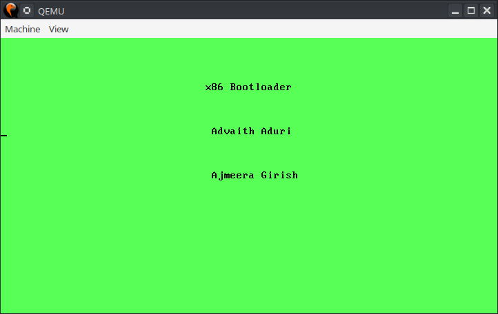

# MPMC-mini-project
## Team Members
* Aduri Sri Sambasiva Advaith / EVD18I002
* Ajmeera Girish Kumar / EVD18I003

# Bootloader for x86 Processors

## Bootloader

In this project we implemented a assembly language bootloader to load a c based kernel. We are going to go through the code for the bootloader. First we check the checksum of the file using the following asm code.  **0x1BADB002** is a magic number in x86 to be identified by the bootloader. From the we calculate checksum using the formula **-(MAGIC + FLAG)**. Here FLAG is set to 0.
~~~ nasm
section .text
    align 4
    dd 0x1BADB002            
    dd 0x00                  
    dd - (0x1BADB002 + 0x00)
~~~

Then we use the extern statement to specify that the symbol for kernel is locaed in a different object file.
~~~ nasm
extern kmain
~~~
When the program starts, we first clear all the inturrupts. Then we set the stack pointer and call the kmain function call.
Finally we halt the cpu.
~~~ nasm
start:
  cli 			
  mov esp, stack_space	
  call kmain
  hlt		 	
~~~
We reserve a stack space of 8kb for the kernel stack.
~~~ nasm
section .bss
resb 8192		
stack_space:
~~~

## C Kernel  

For the kernel, we wrote the source code in c language. Here we are displaying an output to a **VGA Display** of size 80x25. In this display, the video memory starts at 0xb8000 and each pixel occupies two bytes. The first byte is for the character to be displayed and tthe secont character is for the attribute of the pixel which include text color, background color etc.  
Below code shows an example of how we can fill the entire screen with a light green background.
```c
char *vidptr = (char*)0xb8000; 	//video mem begins here.
unsigned int j = 0;
/* there are 25 lines each of 80 columns; each element takes 2 bytes */
while(j < 80 * 25 * 2) {
    /* blank character */
    vidptr[j] = ' ';
    /* attribute-byte - light green on black screen */
    vidptr[j+1] = 0xa0; 		
    j = j + 2;
}
```
In a similar fashion we displayed our project title and our names on the VGA display.

## Linker Script
This script defines how the compiled binary file should be placed in the memory and in what format should the output be linked.

## Compiling and Running
To compile the source code, open a terminal and run **make**. This creates a binary file called kernel which is the final executable. This can be simulated in qemu by typing the following command in qemu:
```bash
qemu-system-i386 -kernel kernel
```
## Output



