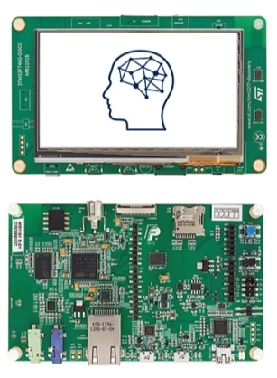
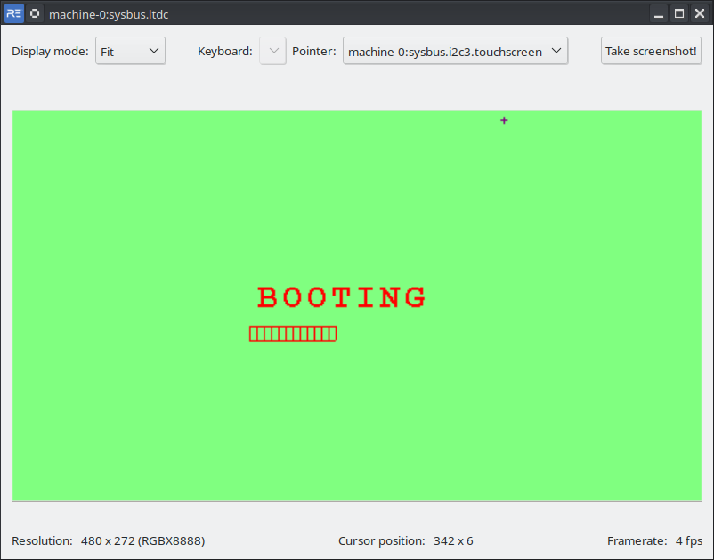
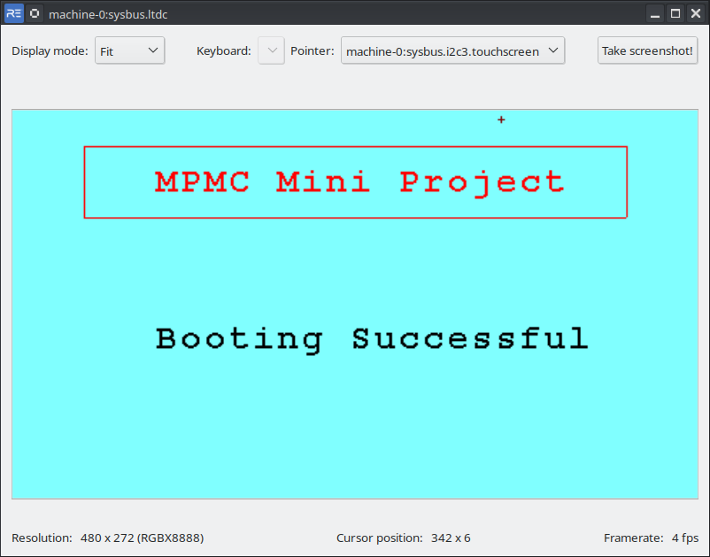
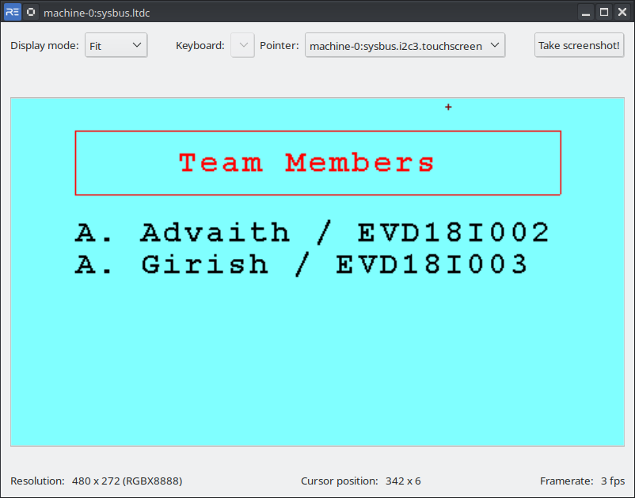
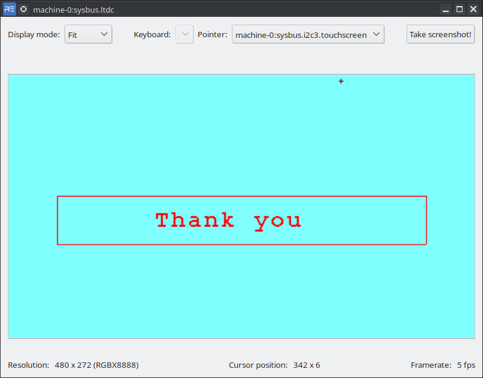

# MPMC-mini-project
## Team Members
* Aduri Sri Sambasiva Advaith / EVD18I002
* Ajmeera Girish Kumar / EVD18I003

# Bootloader for x86 Processors
## Requirements for this project
* gcc
* qemu-system-i386
## Bootloader

In this project we implemented a assembly language bootloader to load a c based kernel. We are going to go through the code for the bootloader. First we check the checksum of the file using the following asm code.  **0x1BADB002** is a magic number in x86 to be identified by the bootloader. From the we calculate checksum using the formula **-(MAGIC + FLAG)**. Here FLAG is set to 0.
~~~ nasm
section .text
    align 4
    dd 0x1BADB002            
    dd 0x00                  
    dd - (0x1BADB002 + 0x00)
~~~

Then we use the extern statement to specify that the symbol for kernel is locaed in a different object file.
~~~ nasm
extern kmain
~~~
When the program starts, we first clear all the inturrupts. Then we set the stack pointer and call the kmain function call.
Finally we halt the cpu.
~~~ nasm
start:
  cli 			
  mov esp, stack_space	
  call kmain
  hlt		 	
~~~
We reserve a stack space of 8kb for the kernel stack.
~~~ nasm
section .bss
resb 8192		
stack_space:
~~~

## C Kernel  

For the kernel, we wrote the source code in c language. Here we are displaying an output to a **VGA Display** of size 80x25. In this display, the video memory starts at 0xb8000 and each pixel occupies two bytes. The first byte is for the character to be displayed and tthe secont character is for the attribute of the pixel which include text color, background color etc.  
Below code shows an example of how we can fill the entire screen with a light green background.
```c
char *vidptr = (char*)0xb8000; 	//video mem begins here.
unsigned int j = 0;
/* there are 25 lines each of 80 columns; each element takes 2 bytes */
while(j < 80 * 25 * 2) {
    /* blank character */
    vidptr[j] = ' ';
    /* attribute-byte - light green on black screen */
    vidptr[j+1] = 0xa0; 		
    j = j + 2;
}
```
In a similar fashion we displayed our project title and our names on the VGA display.

## Linker Script
This script defines how the compiled binary file should be placed in the memory and in what format should the output be linked.

## Compiling and Running
To compile the source code, open a terminal and run **make**. This creates a binary file called kernel which is the final executable. This can be simulated in qemu by typing the following command in qemu:
```console
qemu-system-i386 -kernel kernel
```
## Output


# Bootloader for ARM based Processor
For this project we chose a stm32f746 Discovery Board.
<center></center>

The specifications of the board are:
* STM32F746NGH6 Arm Cortex core-based microcontroller 
* 1 Mbyte of Flash memory
* 340 Kbytes of RAM
* 4.3” RGB 480×272 color LCD-TFT with capacitive touch screen 

## Requirements for this project
* gcc-arm-none-eabi
* Stm32CubeIDE
* Renode

## Project Structure
The project is divided into two parts:
1. Bootloader
2. Application

Two projects are created using the stm32cubeide and once writing the code is completed, the ELF files created by both the projects are copied to a common folder in order to simulate them in renode.  
Let us take a look at the code in both the bootloader and the application.  
Before starting the code, we need to set some configuration options for the mcu to auto generate code for stm32 HAL libraries. These configuration information is stored in .ioc files in the root project folders. The following changes have been made to the mcu in the stm32cubeide:
1. Enable LED on PI0.
2. Enable CRC.
3. Enable Dma2d.
4. Enable RCC and set the high speed clock to crystal/ceramic oscillator.
5. Set the system clock speed to 200Mhz.
Now we can go into the code for the Bootloader once the MCU configuration is completed.  
## Bootloader 
Here first we define the different sections of Flash in the **STM32F746NGHX_FLASH.ld** file as shown:
```ld
MEMORY
{
  RAM    (xrw)    : ORIGIN = 0x20000000,   LENGTH = 320K
  FLASH    (rx)    : ORIGIN = 0x8000000,   LENGTH = 256K
  FLASH1   (rx)    : ORIGIN = 0x8040000,   LENGTH = 1024K-256K
}
```
Here the Bootloader is stored in the *FLASH* whereas the Application is stored in *FLASH1*.  
## MAIN
The main source code for the bootloader are are present in main.c and all the other files are the driver libraries and supporting files for the compilation process.  
We first start load all the dependencies for main.c which is done in the main.h file.
```c
#include "stm32f7xx_hal.h"
#include "stm32746g_discovery.h"
#include "stm32746g_discovery_sdram.h"
#include "stm32746g_discovery_ts.h"
#include "stm32746g_discovery_lcd.h"
```

Then we define the address of the Application.
```c
#define Application_Address 0x8040000
```

Now we define the *boot_to_app* function which takes in the address of the application it boots to as the input.
```c
static void boot_to_app(uint32_t app_addr)
{
	volatile uint32_t jump_addr;
	void (*ResetHandler)(void) = NULL;

	jump_addr = *(__IO uint32_t*) (app_addr + 4);
	ResetHandler = (void (*)(void)) jump_addr;
	__set_MSP(*(__IO uint32_t*) app_addr);

	ResetHandler();
}
```
Here we define a jump address and a function pointer called reset handler. The jump_addr is assigned an integer present 4 bytes offset to the application address. This points to the function which is to be loaded by the bootloader. We assign it to the function pointer named ResetHandler. Then we set the stack pointer to the application address. Then we run the ResetHandler. 

Next we defined the system reset function which disables the Interrupt requests and then calls the NVIC_SystemReset function in case the Bootloader fails to load into the application.
```c
extern void system_restart(void)
{
	__disable_irq();
	NVIC_SystemReset();
}
```
Now we enter the main function. In the main function we follow the following steps to initialize the hardware:
1. First enable CPU cache.
```c
SCB_EnableICache();
SCB_EnableDCache();
```
2. Then initialize the hal library and system clock.
```c
HAL_Init();
SystemClock_Config();
```
3. Initialize all the configured peripherals.
```c
MX_GPIO_Init();
MX_CRC_Init();
MX_DMA2D_Init();
```
4. Initialize SDRAM, LCD and CRC.
```c
BSP_SDRAM_Init();
__HAL_RCC_CRC_CLK_ENABLE();
BSP_TS_Init(480, 272);
BSP_LCD_Init();
BSP_LCD_LayerDefaultInit(0, LCD_FB_START_ADDRESS);
BSP_LCD_DisplayOn();
```

Now we can write to lcd screen using the functions present in *stm32746g_discovery_lcd.h*. Once the initial display to lcd is complete, we jump to application using the following line of code.
```c
boot_to_app(Application_Address);
```
In case there is a situation where the bootloader fails to load the application it performs a system restart.

## Application
The code for the Application is similar to Bootloader in terms of ioc configuration and hardware initialization. Only difference lies in the code code we write for graphics that are to be displayed on the screen and the memory section specified in the linker script.  
The memory section of **STM32F746NGHX_FLASH.ld** file as shown:
```ld
MEMORY
{
  RAM    (xrw)    : ORIGIN = 0x20000000,   LENGTH = 320K
  FLASH   (rx)    : ORIGIN = 0x8040000,   LENGTH = 1024K-256K
}
```
Here we can see that the application is stored at 0x8040000.

## Simulating in RENODE
For simulating in renode, we first need to compile both the Bootloader and the Application seperately and then copy the .elf output files into a common folder. Then we need to open renode in that folder and run the following commands.
```console
mach create
machine LoadPlatformDescription @platforms/boards/stm32f7_discovery-bb.repl
sysbus LoadELF @Application.elf
sysbus LoadELF @Bootloader.elf
showAnalyzer sysbus.ltdc
start
```
Here we first created a machine and loaded the platform description for the stm32 discovery board. Then we load the application and bootloader into memory. We open the analyzer for ltdc driver which is connected to the lcd to see the output. We then sart the simulation.
## Output
<p>&nbsp;</p>
<center><h2> During Booting </h2></center>

<center></center>
<p>&nbsp;</p>
<p>&nbsp;</p>
<center><h2> Application </h2></center>
<center></center>
<center></center>
<center></center>

<p>&nbsp;</p>
<p>&nbsp;</p>
<center><h1> <b>Thank You</b> </h1></center>